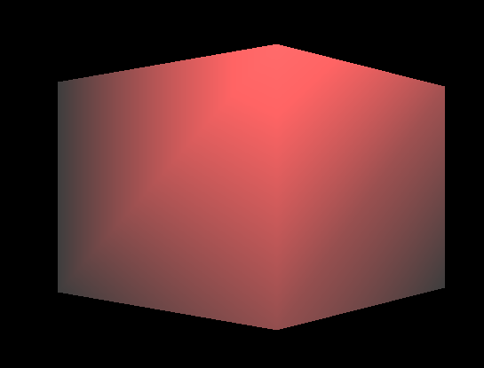
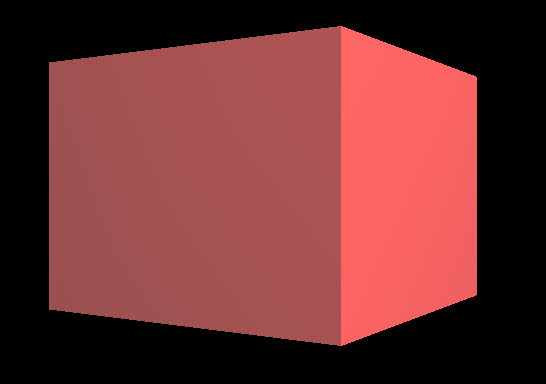
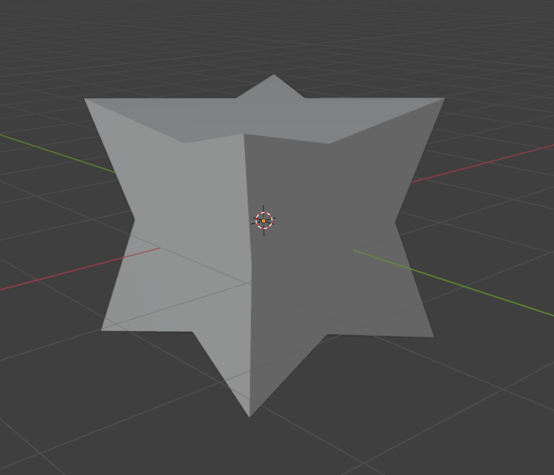
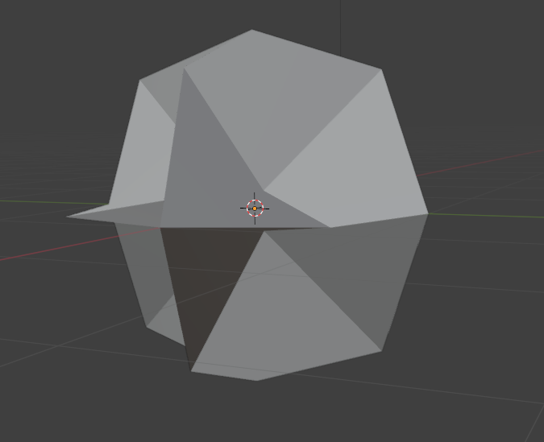
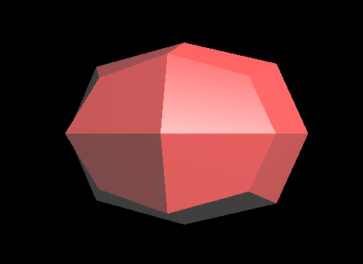
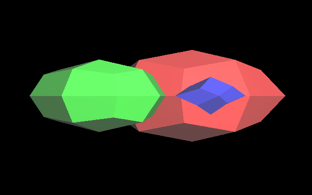
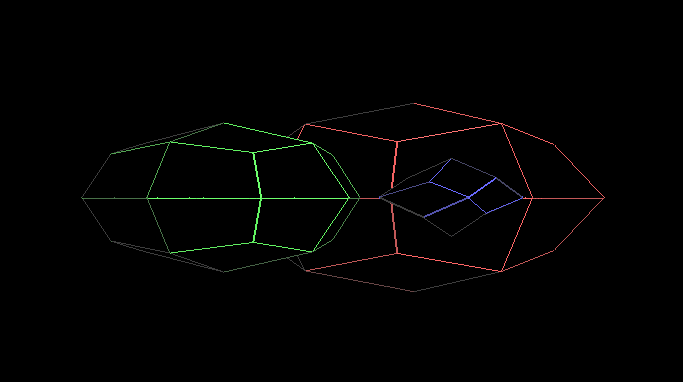
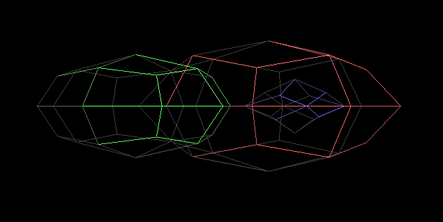

# Computer Graphics II - Catmull-Clark Subdivision Surface Algorithm

## First Visual
I used the given sampleGL code as a starting point for this assignment. First thing I wanted to do was display the given cube object on the screen. The cube consisted of quads so I first had to update the Face structure to be able to represent quads, I also updated the parsing function to be able to read the object file properly. I then wrote a function to turn my quad faces into two triangular faces so I could display them in solid mode as described in the homeowork pdf. I got this visual on screen as a result:

<div style="display: flex;">
  
</div>

## Flat Shading
This visual was using the normals given in the object file and was also interpolating them across the surfaces causing in the smoothed look in the image. In order to get the correct look I had to write a function to calculate my own normals and set the normals for each vertex of each face. Each vertex had 3 incident faces and each of them would need different normals, so I had to duplicate the vertices in order to get the desired effect. A function I wrote took each face in the mesh, created unique vertices for each one, then calculated the face normal and copied it for each vertex in the face. Additionally, I made it so if the original mesh had quad faces, it would take the average of the normals of the triangles that were formed from the original quad to make sure the result would look like a quad rather than 2 triangles. In the end, I got the following visual:

<div style="display: flex;">
  
</div>

My flat shading implementation was complete and my mesh had a single constant on each face. Next, I moved on to the subdivision algorithm itself.

## The Algorithm
The algorithm to generate the new faces for a smoother visual was relatively simple. The difficult part was associating each vertex with its incident edges and faces, each face with its vertices and edges, and each edge with its points and adjacent faces. Doing the assigment without implementing a way to easily track these attributes would be extremely difficult. So the first thing I did was create 3 structures for points, faces and edges; and gave them the capacity to track each others attributes. I called them Point Trackers, Face Trackers and Edge Trackers respectively:

```cpp
    struct PointTracker {
        glm::vec3 position;
        vector<FaceTracker*> faces;
        vector<EdgeTracker*> edges;
        glm::vec3 newPosition;
    };

    struct FaceTracker {
        vector<EdgeTracker*> edges;
        vector<PointTracker*> points;
        glm::vec3 facePoint;
    };

    struct EdgeTracker {
	vector<FaceTracker*> faces;
	vector<PointTracker*> points;
	glm::vec3 edgePoint;
        glm::vec3 midPoint;
	};
```

Next I created 3 unordered maps to actually store and track members of these structures:


```cpp
    unordered_map<int, PointTracker*> pointMap;
    unordered_map<int, FaceTracker*> faceMap;
    unordered_map<pair<int, int>, EdgeTracker*, pair_hash> edgeMap;
```

Points and faces were indexed by their indices in their respective storage vectors, which this method received as a argument. Edges were indexed by the indices of their points in sorted order, i.e: the edge (1,2) was the same as the edge (2,1).

I then traversed every face, every point and every edge in the given mesh and stored data on their neighbors. I ran into many problems during this approach. Initially I tried to store references to other tracker objects within an object, but this caused bugs which I couldnt explain. Then I stored plain objects, this also caused bugs due to copy semantics of CPP and my changes made on an object were not being reflected on other objects tracking it. Here are some visual errors I encountered while fleshing out my method:

<div style="display: flex;">
  
  
</div>

The first image had correct facepoints but incorrect edge points and new vertex points.
The second image had correct face and edge points but its new vertex points were very close to (0,0,0), causing a caved-in look. This is as far as I could get within the homework deadline due to time constraints, but I wanted to keep going and finish it anyway. In the end I decided to store pointers in everything. Which allowed me to display the correct shape of the cube after 1 level of subdivision:

<div style="display: flex;">
  
</div>

## Result

Having finally created the correct visual, I added the other objects to the scene and implemented the other features:

<div style="display: flex;">
  
  
  
</div>

The subdivision method creates new vertices and quad faces from existing quad or triangular faces and stores them in vectors in the same format as the parsing function. These new faces and vertices are then passed through the function described in the beginning to have their normals computed.

In order to render the meshes in line and wire modes, I had to write a new function to compute normals that didn't require the faces to be triangles. I also wrote a new InitVBO function to copy line index data to the gpu rather than face index data, as well as a new drawModel function to draw lines instead of triangles.

In order to have smooth transition between different subdivision levels and rendering modes at runtime, I decided to calculate all subdivision levels first and store them. This way the initial startup may be slow on slow computers, but after that there's no delay between pressing a button and seeing a visual.

I tested my code on my own computer and had a stable 165FPS on all subdivision levels
